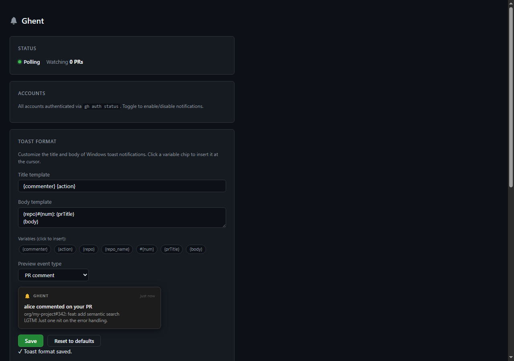
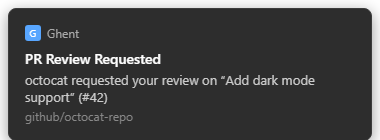

# Ghent: GitHub + GHE Notifications

Windows toast notifications when comments or reviews land on PRs you authored on GitHub.com and GitHub Enterprise. Ghent supports multiple accounts at once, including mixed GH + GHE setups in a single running instance. It runs as a Windows scheduled task, polls each configured account every 90 seconds, and fires a clickable toast that opens the comment in Edge.

**Stack:** Node 22, TypeScript (esbuild bundle), Express, `node-notifier` (SnoreToast), WiX 7 MSI.

## Screenshots

| Config UI | Toast notification |
|---|---|
|  |  |

---

## What it does

- Polls every configured account (GitHub.com and/or GitHub Enterprise) for open PRs you authored and surfaces new comments, review comments, and reviews.
- Also catches `@mention`s on PRs you didn't author.
- Supports multiple accounts simultaneously from one config.
- Skips your own comments.
- Fires a clickable Windows toast — clicking opens the comment URL in Edge.
- Per-PR cooldown (default 3 min) prevents spam when multiple comments land in quick succession on the same PR.
- Appends every event to `%LOCALAPPDATA%\Ghent\events.jsonl` — one JSON object per line.
- On restart, picks up from the last successful poll so nothing is replayed as new.
- Also supports `MODE=webhook` for real-time delivery (requires a public endpoint, e.g. DevTunnel).

---

## Dev setup

```powershell
cd projects/ghe-pr-notifier
npm install
npm run dev        # starts via Task Scheduler (Ghent task must exist)
```

Or run directly:

```powershell
npx tsx src/server.ts
```

Then open **http://localhost:9420/** and add one or more accounts via the web UI (GitHub.com, GHE, or both).

You need [gh CLI](https://cli.github.com) installed and authenticated:

```powershell
gh auth login
gh auth login --hostname your-company.ghe.com
```

A PAT fallback can be set in the UI (needs `repo` + `notifications` scopes) but gh CLI is preferred — token refreshes are transparent without a restart.

---

## Configuration

All config lives in `%LOCALAPPDATA%\Ghent\config.json`. The web UI at http://localhost:9420/ is the preferred way to edit it.

Key fields:

```json
{
  "accounts": [
    {
      "id": "github.com",
      "label": "Personal GitHub",
      "username": "your-gh-username",
      "apiBase": "https://api.github.com",
      "token": ""
    },
    {
      "id": "your-company.ghe.com",
      "label": "Work GHE",
      "username": "your-username",
      "apiBase": "https://your-company.ghe.com/api/v3",
      "token": ""
    }
  ],
  "mode": "poll",
  "pollIntervalSec": 90,
  "notifCooldownSec": 180,
  "port": 9420
}
```

Changes saved via the UI take effect immediately — poll interval changes restart the poller timer for all configured accounts.

---

## Production: scheduled task

```powershell
# Dev task (runs from repo via tsx)
pwsh scripts/install-task.ps1

# MSI-installed task (runs from C:\Program Files\Ghent\)
pwsh scripts/install-task-msi.ps1 -InstallRoot "C:\Program Files\Ghent\"
```

Logs: `%LOCALAPPDATA%\Ghent\task.log` and `%LOCALAPPDATA%\Ghent\events.jsonl`.

```powershell
# Start / stop
Start-ScheduledTask -TaskName Ghent
Stop-ScheduledTask  -TaskName Ghent
```

---

## MSI build

```powershell
npm run msi        # builds dist/Ghent-0.2.0.msi
```

Requires [WiX 7 CLI](https://wixtoolset.org/) (`wix` on PATH) and Node 22 portable runtime at `build/node/node.exe`.

---

## Releasing

Pushing a `v*` tag triggers the **Release** workflow (`.github/workflows/release.yml`) which builds and publishes a GitHub Release with two artifacts:

| Artifact | Contents |
|---|---|
| `Ghent-<version>.msi` | Windows installer (Node runtime + bundle + scheduled task) |
| `ghent-bundle.zip` | Portable bundle (server.cjs + node_modules + assets) |

```powershell
# Tag and push to trigger a release
git tag v0.3.0
git push origin v0.3.0
```

The workflow runs on `windows-latest` and performs: `npm ci` → typecheck → bundle → zip → MSI build → publish. Release notes are auto-generated from commits since the previous tag.

Releases appear at https://github.com/dleblond312/ghent/releases.

---

## Deploy (dev → installed)

```powershell
npm run deploy     # bundle + copy to C:\Program Files\Ghent\ + bounce task
```

Requires one-time icacls grant:

```powershell
icacls "C:\Program Files\Ghent" /grant "$env:USERNAME:(OI)(CI)F" /T
```

---

## Webhook mode

For real-time delivery instead of polling:

```json
{ "mode": "webhook", "webhookSecret": "<32-byte-hex>" }
```

The server exposes `/webhook` — forward it via DevTunnel and register hooks:

```powershell
npm run discover-repos   # find repos with recent PRs
# set REGISTER_REPOS and PUBLIC_WEBHOOK_URL in .env, then:
npm run register
```

---

## Event log format

`%LOCALAPPDATA%\Ghent\events.jsonl` — append-only, one JSON object per line:

```json
{"ts":"2026-05-10T23:11:46Z","source":"poll","kind":"review","repo":"org/my-project","num":341,"prTitle":"feat: add thing","commenter":"someone","body":"LGTM","url":"https://..."}
```

Suppressed toasts (per-PR cooldown) are logged with `"suppressed":true` so no activity is lost.

---

## Troubleshooting

| Symptom | Fix |
|---|---|
| Toast doesn't appear | Open Settings → Notifications → find **SnoreToast** → turn On. Windows defaults it off on first run. |
| `npm run test-toast` prints `DisabledForUser` | Same as above. |
| Server won't start — port 9420 in use | Another instance is running: `Get-NetTCPConnection -LocalPort 9420 \| Select-Object OwningProcess` |
| No notifications for a PR | Check `events.jsonl` — if events appear with `"suppressed":true`, the per-PR cooldown is active. |
| Poll never runs | Check `task.log` for errors. Common: gh CLI not authenticated (`gh auth login --hostname <host>`). |
| Config lost after save | Check `task.log` for `[config] could not read existing config` warnings — indicates corrupt config.json. |
| Lots of noise from old comments | Delete `%LOCALAPPDATA%\Ghent\poller-state.json` — next run reseeds without toasting. |
| GHE shows webhook delivery failing with 401 | *(webhook mode)* `webhookSecret` in config doesn't match what was registered. Re-run `npm run register`. |
| GHE delivery times out | *(webhook mode)* Tunnel is down or port doesn't match `devtunnel host -p`. |
| GHE rejects hook creation with 404 | *(webhook mode)* Token is missing `admin:repo_hook` scope, or you don't have admin on that repo. |

---

## Architecture

### Poll mode (default)

```
                  GitHub API (GitHub.com + GHE)
                          ▲
                          │ GET /repos/:owner/:repo/pulls/comments
                          │ every 90s (configurable)
                          │
                   ┌──────┴──────┐
                   │  poller.ts  │
                   │  (per acct) │
                   └──────┬──────┘
                          │
             ┌────────────┴────────────┐
             ▼                         ▼
      notifier.ts                  logger.ts
     (WinRT toast)     (%LOCALAPPDATA%\Ghent\events.jsonl)
```

State persisted in `%LOCALAPPDATA%\Ghent\poller-state.json` — restarts resume from last poll, no replays.

### Webhook mode (real-time)

```
GitHub repo (GH or GHE) ──webhook──>  https://YOUR-TUNNEL.devtunnels.ms/webhook
                                       │
                              devtunnel relay
                                       │
                                       ▼
                          localhost:9420  (express)
                                       │
                          ┌────────────┴────────────┐
                          ▼                         ▼
                   notifier.ts                  logger.ts
                  (WinRT toast)     (%LOCALAPPDATA%\Ghent\events.jsonl)
```

Requires a public endpoint (DevTunnel) and per-repo webhook registration. Set `"mode": "webhook"` in config.
